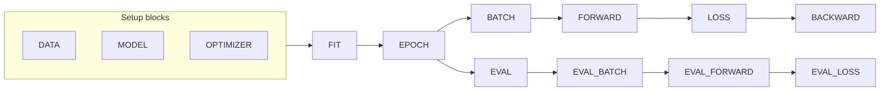

# coffeetrain

Lightweight event-driven PyTorch training runtime with composable plugins. Inspired by [MosaicML Composer](https://github.com/mosaicml/composer), but with fewer external dependencies and support for recent PyTorch versions.

## Features

- **Plugin-based composition**: bundle events, systems, and commands into reusable plugins
- **Decorator-driven wiring**: hook training logic with `@trainer.system('EVENT')`
- **Shared context state**: systems receive kwargs from context and return dict updates
- **CLI commands**: function parameter defaults become hyperparameters for `python train.py train --lr 1e-4`
- **Interruptible default loop**: graceful SIGINT/SIGTERM handling built into the core `train` plugin
- **Optional batteries**: W&B, Comet, EMA, SWA, checkpointing, LR monitoring, and more

## Quick Start

```python
import torch
import torch.nn as nn
from torch.utils.data import DataLoader
import torchvision
import torchvision.transforms as transforms

from coffeetrain import Trainer

trainer = Trainer()


class MnistCNN(nn.Module):
    def __init__(self):
        super().__init__()
        self.net = nn.Sequential(
            nn.Conv2d(1, 32, 3), nn.ReLU(), nn.MaxPool2d(2),
            nn.Conv2d(32, 64, 3), nn.ReLU(), nn.MaxPool2d(2),
            nn.Flatten(),
            nn.Linear(1600, 128), nn.ReLU(),
            nn.Linear(128, 10),
        )

    def forward(self, x):
        return self.net(x)


@trainer.system('DATA_BEFORE')
def load_data():
    transform = transforms.Compose([
        transforms.ToTensor(),
        transforms.Normalize((0.1307,), (0.3081,)),
    ])
    train_ds = torchvision.datasets.MNIST(root='./data', train=True, download=True, transform=transform)
    test_ds = torchvision.datasets.MNIST(root='./data', train=False, download=True, transform=transform)
    return {
        'train_dataloader': DataLoader(train_ds, batch_size=64, shuffle=True),
        'eval_dataloader': DataLoader(test_ds, batch_size=256, shuffle=False),
        'loss_fn': nn.CrossEntropyLoss(),
    }


@trainer.system('MODEL_BEFORE')
def create_model():
    compute_device = torch.device('cuda' if torch.cuda.is_available() else 'cpu')
    return {'model': MnistCNN().to(compute_device), 'device': None, 'compute_device': compute_device}


@trainer.system('OPTIMIZER_BEFORE')
def create_optimizer(model, lr=5e-4):
    return {'optimizer': torch.optim.Adam(model.parameters(), lr=lr), 'lr': lr}


@trainer.system('FORWARD_BEFORE')
def prepare_forward_batch(batch, compute_device):
    inputs, labels = batch
    return {'inputs': inputs.to(compute_device), 'labels': labels.to(compute_device)}


@trainer.system('FORWARD')
def forward_pass(model, inputs):
    return {'outputs': model(inputs)}


@trainer.system('BACKWARD_AFTER')
def optimizer_step(optimizer):
    optimizer.step()
    optimizer.zero_grad()


if __name__ == '__main__':
    trainer()
```

Run training:

```bash
python train.py train --max_epochs 10 --lr 5e-4
```

See [`examples/mnist/main.py`](examples/mnist/main.py) for a complete working example.

## Core Concepts

### Plugin

A plugin bundles related events, systems, and commands. The trainer auto-registers a default plugin set on construction; optional plugins are added with `trainer.register_plugin(...)`.

### System

A system is a function registered on one or more events. Its parameters are filled from shared context and hyperparameter defaults. Return a `dict` to update context:

```python
@trainer.system('BATCH_AFTER')
def log_loss(loss, log):
    log.info(f"loss={loss.item():.4f}")
```

### Command

Commands are top-level entry points dispatched from the CLI. The default `train` command runs the standard training loop:

```bash
python train.py train --max_epochs 20
```

### State

Training state lives in a shared `context` dict on the trainer. Systems can also use injected helpers: `get_state`, `set_state`, `run_event`, and `execution_block`.

| Key | Description |
|-----|-------------|
| `model` | `nn.Module` being trained |
| `optimizer` | PyTorch optimizer |
| `train_dataloader` | Training `DataLoader` |
| `eval_dataloader` | Optional validation `DataLoader` |
| `batch` | Current batch from the dataloader |
| `outputs` | Model outputs from the current forward pass |
| `loss` | Current scalar loss tensor |
| `epoch` | Current epoch (0-indexed) |
| `batch_idx` | Batch index within the epoch |
| `global_step` | Total training batches processed |
| `eval_loss` | Mean validation loss after an eval pass |
| `stop_training` | Set `True` to stop after the current batch |
| `interrupted` | Set when SIGINT/SIGTERM is received |

## Event Lifecycle

The default `train` plugin defines a block-oriented event model. Each block fires `{EVENT}_BEFORE`, `{EVENT}`, and `{EVENT}_AFTER` hooks.



| Event | Phase | Description |
|-------|-------|-------------|
| `DATA` | Setup | Load datasets and loss function |
| `MODEL` | Setup | Build and place model on device |
| `OPTIMIZER` | Setup | Create optimizer(s) |
| `FIT` | Training | Start/end of full training run |
| `TRAINING_INTERRUPTED` | Training | Fired on graceful interrupt |
| `EPOCH` | Epoch | One training epoch |
| `BATCH` | Batch | One training batch |
| `FORWARD` | Batch | Model forward pass |
| `LOSS` | Batch | Loss computation |
| `BACKWARD` | Batch | `loss.backward()` |
| `EVAL` | Eval | Full validation pass |
| `EVAL_BATCH` | Eval | One validation batch |
| `EVAL_FORWARD` | Eval | Forward pass during eval |
| `EVAL_LOSS` | Eval | Loss computation during eval |

## Plugins

### Default (bundled)

Registered automatically when you create a `Trainer()`.

| Plugin | Description |
|--------|-------------|
| `train_plugin` | Interruptible training loop and `train` command |
| `tqdm_progress` | tqdm progress bars for train/eval |
| `cuda_accelerate` | Move batches to CUDA when a device is set |
| `torch_compile` | Optional `torch.compile` on the model |
| `early_stopping` | WIP — not yet functional |

### Optional

Register these when you need them:

```python
from coffeetrain import Trainer, ema_plugin, save_best_model_plugin, wandb_plugin

trainer = Trainer()
trainer.register_plugin([ema_plugin, save_best_model_plugin, wandb_plugin])
```

| Plugin | Description |
|--------|-------------|
| `wandb_plugin` | Weights & Biases logging |
| `comet_plugin` | Comet.ml logging |
| `ema_plugin` | Exponential moving average of weights |
| `swa_plugin` | Stochastic weight averaging |
| `save_best_model_plugin` | Save checkpoint when a metric improves |
| `lr_monitor_plugin` | Log learning rates |
| `parameter_counter_plugin` | Print parameter counts at fit start |
| `batch_size_scheduler` | Gradual batch size warmup |
| `gradient_accumulator` | Gradient accumulation via `override_block` |
| `text_progress` | Plain-text epoch summaries (alternative to tqdm) |

## Writing a Custom Plugin

```python
from coffeetrain import Plugin, Trainer

my_plugin = Plugin(name="my_plugin", description="Example plugin")

@my_plugin.system('FIT_BEFORE')
def on_fit_start(log):
    log.info("Starting training")

@my_plugin.system('BATCH_AFTER')
def track_step(global_step):
    return {'my_step': global_step}

trainer = Trainer()
trainer.register_plugin(my_plugin)
```

Plugin parameter defaults (e.g. `lr=1e-4` on a system or command) are collected as hyperparameters and can be overridden at the CLI.

## Agent Skill

An [agent skill](skill/coffeetrain/SKILL.md) lives in [`skill/coffeetrain/`](skill/coffeetrain/). It teaches AI coding agents how to use coffeetrain — writing training scripts, wiring systems to events, registering plugins, and building custom plugins. To install it for your agent, copy or link the `skill/coffeetrain/` directory into your agent's skills directory (e.g. `~/.agents/skills/`).

## Installation

```bash
pip install coffeetrain
```

Optional extras:

```bash
pip install coffeetrain[wandb,comet,optimi]
```

## Examples

- [`examples/mnist`](examples/mnist) — MNIST CNN with the default training loop
- [`examples/bert-hgnc`](examples/bert-hgnc) — BERT / ModernBERT masked LM on HGNC gene data

## Tests

From the repository root:

```bash
uv run pytest tests -q
```

## License

Apache-2.0
