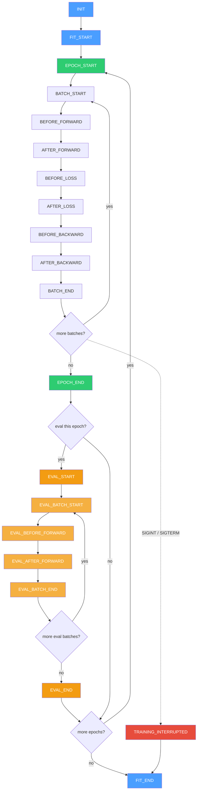

# coffeetrain

Lightweight event-driven PyTorch trainer with composable callbacks. Inspired by [MosaicML Composer](https://github.com/mosaicml/composer) but implemented fewer external dependencies and allowing a newer PyTorch version (2.10 as of this point).

## Features

- **Event-driven lifecycle**: `fit_start`, `epoch_start`, `batch_start`, `before_forward`, `after_forward`, `before_loss`, `after_loss`, `before_backward`, `after_backward`, `batch_end`, `eval_*`, etc.
- **Composable callbacks**: EMA, SWA, checkpointing, W&B, Comet, early stopping, batch size scheduling, and more.
- **TrainerModel protocol**: Simple interface (`forward`, `loss`) for model integration.
- **Accelerate support**: Distributed training via HuggingFace Accelerator.

## Event Lifecycle

The trainer fires events at fixed points in the training loop. Callbacks implement matching methods to hook into any stage.



Each event is dispatched via `_run_event()`, which calls the matching method on every registered callback with the shared `State` object. Callbacks can read or mutate state — for example, setting `state.stop_training = True` to trigger early stopping.

## Installation

```bash
pip install coffeetrain
```

Optional extras:
```bash
pip install coffeetrain[wandb,comet,optimi]
```

## Quick Start

```python
from coffeetrain import Trainer, CosineWarmupScheduler, HistoryCallback, BestModelCheckpointer
from coffeetrain import create_optimizer
from coffeetrain.optimizers import OptimizerConfig

model = MyModel()
optimizer = create_optimizer(model.parameters(), OptimizerConfig(name="adamw", lr=1e-4, weight_decay=0.01))
scheduler = CosineWarmupScheduler(optimizer, warmup_steps=100, total_steps=1000)

trainer = Trainer(
    model=model,
    train_dataloader=train_loader,
    optimizers=optimizer,
    schedulers=scheduler,
    max_epochs=10,
    callbacks=[
        HistoryCallback(save_dir="output"),
        BestModelCheckpointer(save_dir="output", metric_name="loss", mode="min"),
    ],
)
trainer.fit()
```

## Callbacks

| Callback | Description |
|----------|-------------|
| `BestModelCheckpointer` | Save best model by metric |
| `HistoryCallback` | Track and save training history to JSON |
| `EMACallback` | Exponential moving average of weights |
| `SWACallback` | Stochastic weight averaging |
| `EarlyStoppingCallback` | Stop when metric stops improving |
| `WandbCallback` | Log to Weights & Biases |
| `CometCallback` | Log to Comet.ml |
| `BatchSizeSchedulerCallback` | Batch size warmup |
| `ScheduleLoggerCallback` | Log LR schedule phase transitions |
| `ParameterCounter` | Print parameter counts at start |
| `SpeedMonitor` | Track samples/sec |
| `ProgressCallback` | Print epoch summaries |
| `LRMonitor` | Log learning rates |
| `TorchMetricsCallback` | Integrate torchmetrics |

## Custom Callbacks

Subclass `Callback` and override only the event methods you need — everything else is a no-op by default. Each method receives the shared `State` object, which carries the model, optimizers, current batch, loss, metrics, and progress counters. Callbacks can freely read state and mutate it (e.g. set `state.stop_training = True`).

A few things to keep in mind:

- **`state.callback_state`** is a shared dict where callbacks can store arbitrary data without colliding with core fields. Namespace your keys (e.g. `state.callback_state["my_callback.counter"]`).
- **`state_dict` / `load_state_dict`** — override these if your callback carries state that should survive checkpointing and resume.
- **Ordering matters** — callbacks run in the order they appear in the `callbacks` list. If one callback depends on values set by another, place it later in the list.

### Starter Template

Copy this and delete the methods you don't need:

```python
from coffeetrain.callback import Callback
from coffeetrain.state import State


class MyCallback(Callback):

    # ── Initialization ────────────────────────────────────────────
    def init(self, state: State) -> None: ...
    def fit_start(self, state: State) -> None: ...
    def fit_end(self, state: State) -> None: ...

    # ── Epoch ─────────────────────────────────────────────────────
    def epoch_start(self, state: State) -> None: ...
    def epoch_end(self, state: State) -> None: ...

    # ── Training batch ────────────────────────────────────────────
    def batch_start(self, state: State) -> None: ...
    def before_forward(self, state: State) -> None: ...
    def after_forward(self, state: State) -> None: ...
    def before_loss(self, state: State) -> None: ...
    def after_loss(self, state: State) -> None: ...
    def before_backward(self, state: State) -> None: ...
    def after_backward(self, state: State) -> None: ...
    def batch_end(self, state: State) -> None: ...

    # ── Evaluation ────────────────────────────────────────────────
    def eval_start(self, state: State) -> None: ...
    def eval_batch_start(self, state: State) -> None: ...
    def eval_before_forward(self, state: State) -> None: ...
    def eval_after_forward(self, state: State) -> None: ...
    def eval_batch_end(self, state: State) -> None: ...
    def eval_end(self, state: State) -> None: ...

    # ── Checkpointing ─────────────────────────────────────────────
    def state_dict(self) -> dict: ...
    def load_state_dict(self, state_dict: dict) -> None: ...
```

### `State` Quick Reference

| Field | Type | Available from | Description |
|-------|------|----------------|-------------|
| `model` | `nn.Module` | `init` | The model being trained |
| `optimizers` | `list[Optimizer]` | `fit_start` | All optimizers |
| `schedulers` | `list[LRScheduler]` | `fit_start` | All LR schedulers |
| `train_dataloader` | `DataLoader` | `fit_start` | Training data |
| `eval_dataloader` | `DataLoader \| None` | `fit_start` | Validation data |
| `batch` | `Any` | `batch_start` | Current batch from the dataloader |
| `outputs` | `Any` | `after_forward` | Return value of `model.forward()` |
| `loss` | `Tensor \| None` | `after_loss` | Current loss value |
| `epoch` | `int` | `epoch_start` | Current epoch (0-indexed) |
| `batch_idx` | `int` | `batch_start` | Batch index within the epoch |
| `global_step` | `int` | `batch_start` | Total batches processed so far |
| `max_epochs` | `int` | `init` | Configured epoch limit |
| `grad_accum` | `int` | `init` | Gradient accumulation steps (mutable) |
| `stop_training` | `bool` | any | Set `True` to stop after current batch |
| `train_metrics` | `dict[str, float]` | any | Accumulated training metrics |
| `eval_metrics` | `dict[str, float]` | `eval_end` | Accumulated evaluation metrics |
| `device` | `torch.device` | `init` | Training device |
| `is_main_process` | `bool` | `init` | `True` on rank 0 / single-process |
| `callback_state` | `dict[str, Any]` | any | Shared scratch space for callbacks |

## License

Apache-2.0

## Tests

From repository root:

```bash
uv run pytest packages/coffeetrain/tests -q
```
